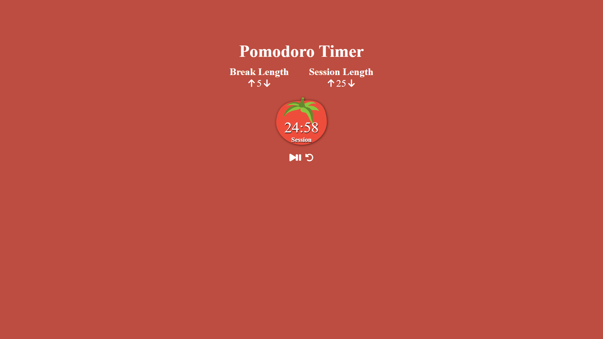

<h1 align="center">
   Pomodoro Timer - 25 + 5 clock
</h1>

## 
 <u>Preview da página:</u> 

  

> O app se resume a um relógio que aplica a técnica de pomodoro, onde se tem um período determinado para produtividade seguido por um período de descando, em ciclos."

<h4 align="center"><a href="https://tahaluh.github.io/pomodoro-timer/" target="_blank">Clique para visitar o projeto</a></h4>

---
# 💼 Tecnologias Utilizadas

As seguintes ferramentas foram usadas na construção do projeto:

- Html
- Css
- ReactJS

*Também foram aplicados conceitos de responsividade*

# ⚙️ Instalação

### Client

  1. `$ cd client`
  2. `$ npm install`
  3. `$ npm start`

# 🛠️ Funcionalidades

- Alterar quantidade de minutos durante a Sessão ou Intervalo
- Alerta sonoro ao fim do período atual

---

### Ajustes e melhorias

O projeto ainda está em desenvolvimento e as próximas atualizações serão voltadas nas seguintes tarefas:

- [ ] Melhoria no design do site, com apresentação interativa com o tempo restante

---

Feito por Thauã Magalhães 👋🏽 Entre em contato!

 

